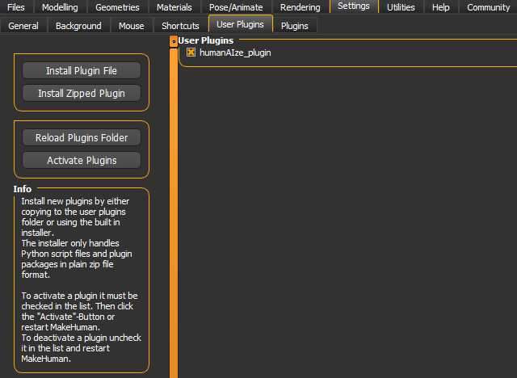

# HumanAIze

## Project Description

**HumanAIze** is a plugin developed for [MakeHuman](https://static.makehumancommunity.org/makehuman.html), an open-source software for creating personalized 3D anthropometric models. This project utilizes machine learning algorithms to automatically generate personalized parameters from textual descriptions, simplifying and accelerating the creation process of complex humanoid characters.

## Objectives

- Automate the generation of 3D models in MakeHuman based on textual descriptions.
- Experiment with artificial intelligence techniques, including data preprocessing, regression (with boosting), and software integration.
- Create a synthetic dataset suitable for training the machine learning model.

## Installation

### Requirements

- MakeHuman version 1.3.0 ([https://static.makehumancommunity.org/mpfb/downloads.html](https://static.makehumancommunity.org/mpfb/downloads.html))
- Required libraries:
  - `pandas`
  - `xgboost`
  - `scikit-learn`

### Steps

1. Open the terminal and go to the Python MakeHuman console folder:
   ```bash
   cd C:/Path/to/Makehuman/../makehuman-community/Python 
2. Install the requirements in the MakeHuman Python console using pip:
    ```bash
   ./python -m pip install pandas xgboost scikit-learn
3. Download _humanAlze_plugin.zip_ from the release.
4. Extract it, so you have a folder with this structure:
    ```
   humanAlze_plugin/
    ├── core/
    │   ├── humanaize.py        # Main script
    │   ├── prompt_task.py      # Supporting functions
    ├── data/
    │   ├── dataset.csv         # Dataset used
    ├── resources/
    │   ├── icon.png            # Graphic resources
    ├── __init__.py             # Initialization file
5. Place the extracted humanAIze_plugin folder into the specified path:
    ```
   C:/Path/to/Documents/../makehuman/v1py3/plugins
**ATTENTION:**

If you can't find the folder at the specified path, make sure to open MakeHuman, go to: **Settings → User Plugins** and click on **'Reload User Plugins'**.


6. Close (if necessary) MakeHuman and restart, now you can use _HumanAIze_ going to **Utilities → Prompt Generator**

## Repository structure

    HumanAIze/
    ├── humanAlze_plugin/
    │   ├── core/
    │   │   ├── humanaize.py        # Main script
    │   │   ├── prompt_task.py      # Supporting functions
    │   │   ├── __init__.py         # Initialization file
    │   ├── data/
    │   │   ├── dataset.csv         # Dataset used
    │   ├── resources/
    │   │   ├── icon.png            # Graphic resources
    ├── ModifierNames               # Parameter configuration file
    ├── README.md                   # Project documentation
    ├── requirements.txt            # Necessary dependencies